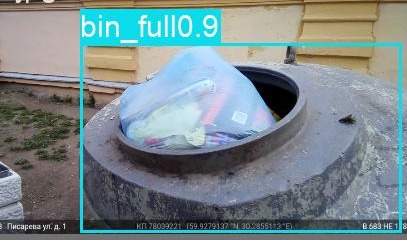
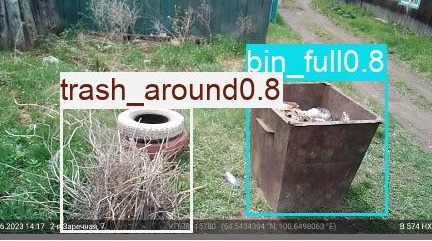
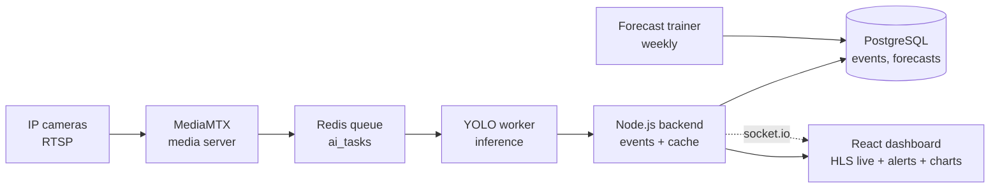
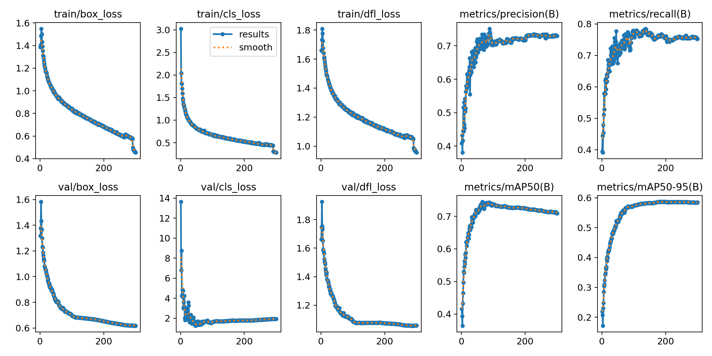
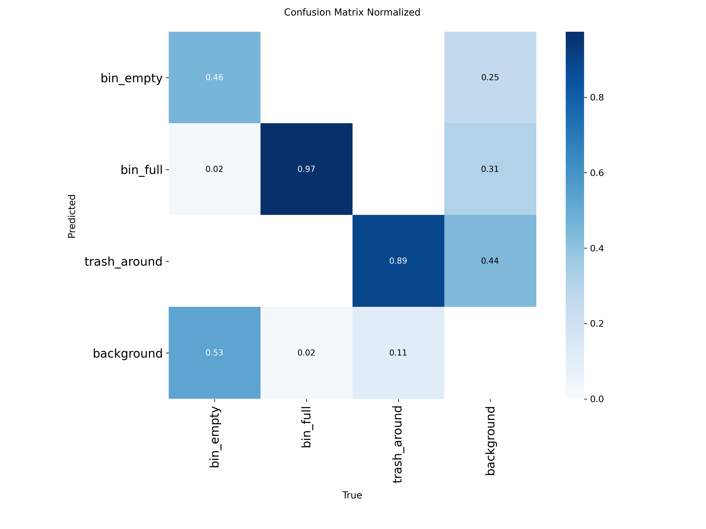
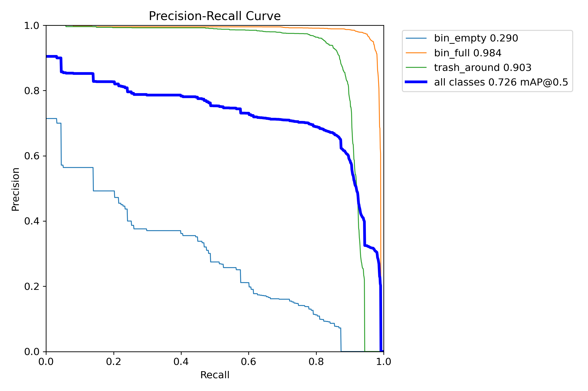
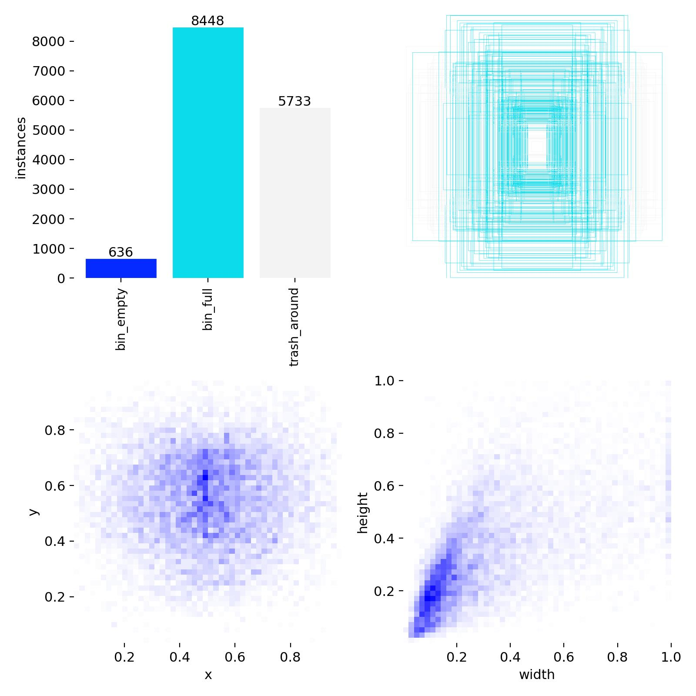

# AI Vision — Multi-Camera Waste Monitoring Platform

Production-grade video analytics platform for autonomous monitoring of waste container sites: live detection of overflowing bins and litter, real-time alerts, and overflow forecasting — from IP cameras to an operator dashboard.

> Showcase repository: architecture, model and results. Source code is private.

---

## What it does

- **Live perception** — every connected camera is polled on schedule; each frame is checked for `bin_empty`, `bin_full` and `trash_around`
- **Priority logic** — `trash_around` outranks `bin_full`, which outranks `bin_empty`, so operators see the most urgent state first
- **Instant alerts** — overflow or litter events (with confidence + snapshot) are stored and pushed to the dashboard in real time
- **24-hour forecast** — a gradient-boosting model predicts the probability of overflow / litter for the next 24 hours per camera
- **Operator dashboard** — live multi-camera grid, event history with snapshots, statistics and forecast charts

## Detections

*Live model predictions: overflowing bins and scattered litter with confidence scores.*

## How it works

1. **Capture** — the worker pulls a snapshot per camera from the media server (HLS fallback if snapshot fails)
2. **Inference** — custom YOLOv8 model, 640×360, conf 0.35 / IoU 0.45; annotated frame encoded and broadcast
3. **Decide & store** — highest-priority class wins; `bin_full` / `trash_around` create alert events with snapshots
4. **Forecast** — weekly retraining on event history; per-camera 24h probability curves served to the dashboard
5. **Serve** — six Docker services (Postgres, Redis, MediaMTX, backend, AI worker, Nginx) behind one reverse proxy with JWT + per-worker auth

## Model

| | |
|---|---|
| **Architecture** | YOLOv8, fine-tuned from pretrained weights (Ultralytics 8.3.40) |
| **Classes (3)** | `bin_empty` · `bin_full` · `trash_around` |
| **Dataset** | ~11.7k annotated images, YOLO format (train / valid / test) |
| **Training** | 300 epochs · imgsz 1024 · batch 12 · GPU · early-stopping patience 100 |
| **Validation** | Precision **0.73** · Recall **0.75** · mAP50 **0.71** · mAP50-95 **0.58** |
| **Forecasting** | Gradient Boosting (50 trees) + scaler, time-of-day / day-of-week features |

*Training: loss, precision/recall and mAP over 300 epochs.*

*Dataset composition: class balance and bounding-box distribution.*

## What I built

- Custom **3-class dataset pipeline** (collection → annotation QA → augmentation → YOLO export) and **fine-tuning of pretrained YOLOv8 through 6 weight iterations** to the production `best` checkpoint
- **AI worker**: scheduled multi-camera polling, Redis task queue with deduplication, snapshot→HLS fallback capture, priority mapping, annotated-frame streaming
- **Forecasting module**: negative sampling of quiet hours, sample weighting, weekly retraining, 24h probability API
- **Backend**: dual auth (JWT users + worker keys), AES-256-GCM camera credentials, per-device token rotation, media-server self-healing, 30-day retention
- **Dashboard**: live camera grid, event timeline with snapshots, statistics and forecast visualization
- **Infrastructure**: Docker Compose for all 6 services, Nginx routing (API / sockets / HLS), Postgres schema

## Stack

`Python` `PyTorch` `Ultralytics` `OpenCV` `scikit-learn` `Node.js` `Express` `Socket.IO` `PostgreSQL` `Redis` `React` `Recharts` `MediaMTX` `Nginx` `Docker`
